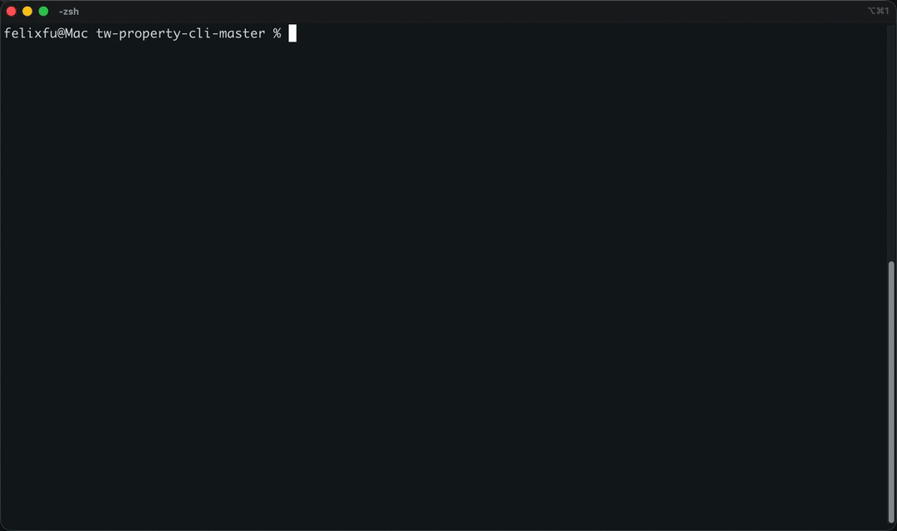

# TW Property Price CLI (台灣實價登錄 CLI)

[](https://www.npmjs.com/package/tw-lvr-cli) [](./LICENSE) [](https://nodejs.org)

**A low-context-footprint, high-reliability CLI for Taiwan property transaction data from 內政部實價登錄** — turns the latest building-level **sale prices and transacted rents** into clean JSON/CSV that stays on disk, out of the LLM's context. For agents, apps, and scripts. Shipped with a portable Agent Skill (`SKILL.md`) as a Claude/Codex-compatible plugin. The npm package stays `tw-lvr-cli`; the command stays `tw-lvr`.

> 繁體中文為主要版本 → [README.md](./README.md). Just looking up one building? Use 591 or 樂居 — free, great UIs, already cleaned. TW Property Price CLI fills the other gap: **clean, latest Taiwan property transaction data a program, app, or agent can consume directly.**
> Checking rent levels? Listing sites show **asking** rents; `--rent` returns the registry's **transacted** rents — with lease period, rental type, and a flag that separates subsidized social-housing leases from the market.

<p align="center">
  
</p>

---

## Core value: low context footprint × high reliability

An agent / app / script can pull **thousands to tens of thousands of transactions in one go** while the model's context stays almost untouched. Four design pieces behind it:

**① Results stay on disk, never touch context**
`--out` writes a whole district to one file; pull the rows you want with `--top N` or jq/grep — the data never enters the model's context.

**② Shape: CLI + library + portable Skill — no server to host**
Nothing loads into context until you invoke it; the Skill keeps only its short name + description resident, loading the body on use. `import` it straight into a web backend, CI, or cron.

**③ Performance & reliability: deterministic and repeatable**
The same query always returns the same result; **~2–3s per query** (CLI end-to-end, startup included). The logic lives in code, not in a model driving a browser in the loop (slow, unstable, token-hungry).

**④ Output: clean, structured JSON / CSV**
What you get is program-ready structured data.

---

## For AI agents

Use tw-lvr-cli as your agent's 實價登錄 data source: install it as a Claude Code/Codex plugin (Agent Skill included), or call `tw-lvr` to write a whole district's transactions to JSON/CSV. No resident MCP, nothing in context before you call it, and `--out` keeps large results on disk.

## Scope (vs. using the official registry website yourself)

The official site is free, the most complete source, and ideal for a *human* looking up one property in a browser. TW Property Price CLI doesn't replace it — it turns the site's "manual, one-at-a-time, web-page" workflow into "command in, clean structured data out, batchable, callable by code."

| What you can do on the website | What TW Property Price CLI adds |
|---|---|
| Query one filter set, read an HTML table | One command → clean JSON / CSV |
| Manual copy | `--out` to a file, drop into a pipeline |
| No batch: page through a whole district | Pull a whole district in one call, to disk |
| Human clicks only, not programmable | Callable by a script / agent / backend |

**Covered today:** existing-home sale (買賣), pre-sale (預售屋), and **rental (租賃, `--rent`)** queries. Rental has its own output schema (monthly rent / rent-per-ping / lease period / management-org / furniture), not the sale fields reshaped. **Not yet:** pre-sale-project registry (預售屋建案) — a project list with a different schema, tracked as a follow-up.

The 3 latest **transacted rents** in 大安區 (fields excerpted; full dictionary: `tw-lvr glossary --rent`):

```bash
tw-lvr extract --where "台北市大安區" --from 202401 --to 202606 --rent --refine --top 3
```

```json
[
  { "address": "大安區臨江街93號三樓之1",           "txnDateRoc": "115/05/20", "monthlyRentTwd": 15000, "unitRentTwdPing": 2479, "rentalType": "分租套房", "rentalService": "一般代管",     "rentPeriod": "1150601~1160531" },
  { "address": "大安區復興南路一段107巷5弄8號四樓", "txnDateRoc": "115/05/20", "monthlyRentTwd": 15200, "unitRentTwdPing": 3802, "rentalType": "分租雅房", "rentalService": "一般轉租",     "rentPeriod": "1150620~1160619" },
  { "address": "大安區安居街124巷6號二樓",          "txnDateRoc": "115/05/20", "monthlyRentTwd": 22000, "unitRentTwdPing": 962,  "rentalType": "整戶出租", "rentalService": "社會住宅代管", "rentPeriod": "1150521~1160520" }
]
```

The third row is a subsidized social-housing lease (962 元/坪 vs market 2,479–3,802) — `rentalService` lets you separate subsidized leases from market rent, which listing sites can't do.

> Rental tip: MOI switched to a new rental reporting form in Sep 2023 and the government site keys the two eras to different internal codes — this tool queries both, so coverage is continuous and current (check the per-year `coverage:` stderr line before reading a trend). Post-2023-09 leases carry extra fields: `rentalType` (出租型態), `rentalService` (rental-service business — values starting with `社會住宅` are subsidized social housing; drop them for market-rate comps), `hasElevator`, `equipment`. A road in `--where` is applied client-side for rent (the government site only resolves rental queries to district level; stderr notes the district→road counts).

---

## Example output

Latest 3 transactions on 關新路 in the Hsinchu Science Park area (關埔 redevelopment zone):

```bash
tw-lvr extract --where "新竹市東區關新路" --from 202401 --to 202612 --top 3 --pretty
```

`--top 3`: return only the 3 most recent rows, **newest always first** (drop it to get everything). Output (fields abbreviated; full set via `tw-lvr glossary`):

```json
[
  {
    "building": "丹麥",
    "address": "新竹市關新路19巷99號二樓",
    "txnDateRoc": "114/12/27",
    "totalPriceWan": 2380,
    "siteAdjUnitPrice": 48.1445,
    "totalAreaPing": 49.43,
    "layout": "3房2廳2衛"
  },
  {
    "building": "北歐",
    "address": "新竹市關新路19巷3號十二樓",
    "txnDateRoc": "114/12/27",
    "totalPriceWan": 3930,
    "siteAdjUnitPrice": 45.6988,
    "totalAreaPing": 86,
    "layout": "4房2廳2衛"
  },
  {
    "building": "月影",
    "address": "新竹市關新路29號十二樓之33",
    "txnDateRoc": "114/12/14",
    "totalPriceWan": 1050,
    "siteAdjUnitPrice": 53.3028,
    "totalAreaPing": 19.7,
    "layout": "1房1廳1衛"
  }
]
```

Add `--refine` for exclusion flags (親友 / 純車位 / 非住宅) and per-record `confidence`; add `--out result.json` to write to disk and keep it out of context entirely.

## Use as a plugin (Claude Code & Codex)

The plugin bundles an Agent Skill (`skills/tw-lvr-cli/SKILL.md`, the open Agent Skills standard) as the instruction layer — it tells the agent when and how to call `tw-lvr`; the `tw-lvr` CLI does the actual work. Install the plugin and just try it: SKILL.md guides the agent to install the CLI (`npm i -g tw-lvr-cli` or `npx`) and the browser on first use.

**Claude Code:**
```
/plugin marketplace add felixfu824/taiwan-property-price-cli
/plugin install tw-lvr-cli@tw-lvr-cli
```

**Codex:**
```bash
codex plugin marketplace add felixfu824/taiwan-property-price-cli
codex plugin add tw-lvr-cli@tw-lvr-cli
```

---

## Use as a CLI

**1. Install**

```bash
npm i -g tw-lvr-cli                               # or: bun add -g tw-lvr-cli
npx playwright install chromium-headless-shell   # REQUIRED — the one non-JS dependency (~190MB)
```

`chrome-headless-shell` is mandatory; if missing the tool exits with code `6` (`ERR_ENV`) and prints the install command. To try without a global install, run `npx -y tw-lvr-cli@latest extract ...` (still install the browser first).

**2. Commands**

```bash
tw-lvr extract --where "台北市信義區松德路169巷" --from 202401 --to 202612 --refine --pretty
tw-lvr extract --where "新北市板橋區文化路一段" --from 202301 --to 202612 --out transactions.csv
tw-lvr extract --where "苗栗縣竹南鎮" --from 202601 --to 202612 --presale --community "藏富天下"

tw-lvr glossary       # explain every output field, its origin, and formula
tw-lvr --help / --version
```

Full surface:
```
tw-lvr extract --where <address> --from <YYYYMM> --to <YYYYMM>
               [--refine] [--ptype 1,2] [--query biz|sale|rent | --presale | --rent]
               [--top N | --limit N] [--community <name>]
               [--out <file|dir>] [--format json|csv] [--pretty]
```
- `--query biz` (existing-home sale) is the default; `--presale` switches to the pre-sale tab; `--rent` switches to rental (rental output schema — see `tw-lvr glossary --rent`).
- **Keep results off-context:** beyond a handful of rows, use `--out` and read back only the slice you need.
- For long spans / dense districts, chunk the month range (≤60 months per call); one oversized response fails with `ERR_NETWORK`.
- Exit codes: `0` ok/empty · `2` bad input · `3` site changed · `4` network · `5` rate limited · `6` environment/browser · `7` partial.
- From source: `bun install && bun run build`, then `node dist/cli.js extract ...`.
- Need programmatic access? The same engine can be `import`ed directly (`extract` / `extractRefined`, types in `src/index.ts`).

---

## Architecture

```
Resolve → Fetch → Normalize → Refine
```
- **Resolve:** parse the human address + month range into the government site's query params.
- **Fetch:** launch a transient headless Chromium and capture the raw `QueryPrice` transaction rows.
- **Normalize:** turn raw government rows into clean, typed `CleanRawRecord`s — unified field names, units (坪/萬元), and ROC dates, with no judgement applied.
- **Refine** (only with `--refine`): adds the site-displayed adjusted unit price, exclusion flags (親友/純車位/非住宅), and `confidence` on top of Clean Raw.

---

## Data &amp; license

- **Data:** Taiwan Ministry of the Interior real-price open data under the **Open Government Data License (OGDL, convertible to CC BY 4.0)**; **attribution to 內政部 is required**; de-identified by law (平均地權條例 §47) — do not attempt re-identification.
- **Code:** Apache-2.0 (see `LICENSE` and `NOTICE`).
- **Privacy:** tw-lvr-cli runs locally — it sends no telemetry, collects no personal data, creates no account, and transmits nothing externally; all output is written only to the local path you pass via `--out`. Its only outbound network request is to the Taiwan real-price registry (`lvr.land.moi.gov.tw`) to fetch public, already-de-identified transaction records.
- Not affiliated with or endorsed by 內政部; provided as-is, no warranty.
